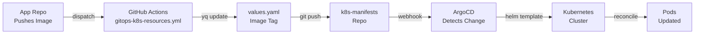

# Kubernetes Manifests - k8s-manifests

Production-grade Kubernetes deployment using Helm + ArgoCD for multi-app architecture.

**Status:** ✅ Production Ready | **K8s Version:** 1.29.15+ | **Helm:** 3.x+

---

## 🏗️ Architecture Overview

```
┌─────────────────────────────────────────────────────────────┐
│                    Ingress (nginx)                          │
│                    axric.co.th                              │
└───────────────────────┬─────────────────────────────────────┘
                        │
        ┌───────────────┼───────────────┐
        │               │               │
        ▼               ▼               ▼
    /api        /api/v1         /   (static)
    │           │               │
    ▼           ▼               ▼
┌─────────────┐ ┌──────────────┐ ┌─────────┐
│ Axric API   │ │ Rekakim     │ │ Axric   │
│ Node.js:3000│ │ Backend:1080 │ │ FE:80   │
└──────┬──────┘ └──────┬───────┘ └─────────┘
       │               │
       └───────┬───────┘
               │
    ┌──────────┴──────────┐
    │                     │
    ▼                     ▼
┌──────────────────┐  ┌──────────────────┐
│  PostgreSQL      │  │  Kafka           │
│  axric-postgres  │  │  kafka-prod      │
│  Port: 5432      │  │  Port: 9092      │
│  NodePort:30501  │  │  (internal)      │
└──────────────────┘  └──────────────────┘

Namespaces:
- axric (Axric API + Frontend)
- rekakim-backend (Rekakim application)
- axric-db (PostgreSQL)
- kafka-prod (Production Kafka)
- kafka-dev (Development Kafka, external access)
- argocd (GitOps controller)
```

---

## 📋 Prerequisites

### Required
- **Kubernetes Cluster:** 1.29.15+ (tested on 1.29.15)
- **Helm:** 3.x+
- **kubectl:** 1.29+
- **ArgoCD:** 2.10+ (for GitOps deployment, optional for manual)

### Recommended
- **Kustomize:** For values overlays
- **Sealed Secrets:** For production secret management
- **Prometheus:** For monitoring (future)

### Cluster Requirements
- Minimum 2 nodes (for pod spreading)
- 8GB RAM total, 4 CPU cores
- Storage class for persistent volumes

---

## 🚀 Quick Start

### Option 1: ArgoCD (Recommended for Production)

```bash
# 1. Update repository URL in the application manifest
# Edit k8s/argocd/application.yaml and set:
# - metadata.namespace: argocd (your ArgoCD namespace)
# - spec.source.repoURL: https://github.com/YOUR-ORG/k8s-manifests.git

# 2. Apply ArgoCD Application
kubectl apply -f k8s/argocd/application.yaml

# 3. Check sync status
argocd app get axric-k8s-export
argocd app sync axric-k8s-export

# 4. Watch deployment
kubectl get pods -n axric -w
kubectl get pods -n rekakim-backend -w
```

### Option 2: Helm (Manual, for Testing)

```bash
# Using default values (production)
helm install axric-deployment k8s/charts -n axric --create-namespace

# Using development values
helm install axric-deployment k8s/charts -n axric \
  -f k8s/charts/values-dev.yaml --create-namespace

# Using staging values
helm install axric-deployment k8s/charts -n axric \
  -f k8s/charts/values-staging.yaml --create-namespace

# Upgrade existing deployment
helm upgrade axric-deployment k8s/charts -n axric
```

---

## 📁 Repository Structure

```
k8s-manifests/
│
├── .docs/                          # Documentation
│   ├── ARCHITECTURE.md
│   ├── DEPLOYMENT.md               # Runbook & procedures
│   ├── MONITORING.md               # Observability & logs
│   ├── SECURITY.md                 # Security checklist
│   └── SECRETS.md                  # Credentials management
│
├── .github/
│   ├── workflows/
│   │   ├── gitops-k8s-resources.yml    # Auto image updates
│   │   └── deploy-helm.yml
│   ├── WORKFLOWS.md                # CI/CD documentation
│   └── CONTRIBUTING.md
│
├── k8s/
│   ├── argocd/
│   │   └── application.yaml        # ArgoCD Application CRD
│   │
│   ├── charts/
│   │   ├── Chart.yaml              # Helm metadata
│   │   ├── values.yaml             # Production values
│   │   ├── values-dev.yaml         # Development overrides
│   │   ├── values-staging.yaml     # Staging overrides
│   │   ├── values-prod.yaml        # Production overrides (explicit)
│   │   ├── values.schema.json      # Schema validation
│   │   │
│   │   └── templates/
│   │       ├── deployments/
│   │       │   ├── axric-deployment.yaml
│   │       │   └── rekakim-deployment.yaml
│   │       ├── statefulsets/
│   │       ├── services/
│   │       ├── ingresses/
│   │       ├── configmaps/
│   │       ├── secrets/
│   │       ├── rbac/
│   │       ├── namespaces/
│   │       └── _helpers.tpl
│   │
│   ├── README.md
│   └── INVENTORY.md
│
├── CHANGELOG.md
├── README.md                       # This file
├── .gitignore
└── LICENSE

```

---

## 🔧 Configuration

### Environment-Specific Values

The chart supports three environments via separate values files:

#### **Development** (`values-dev.yaml`)
```yaml
# Lower replicas, minimal resources
replicaCount: 1
resources:
  requests:
    memory: 128Mi
    cpu: 50m
```

#### **Staging** (`values-staging.yaml`)
```yaml
# Intermediate setup
replicaCount: 2
resources:
  requests:
    memory: 256Mi
    cpu: 100m
```

#### **Production** (`values-prod.yaml`)
```yaml
# Full redundancy
replicaCount: 3
resources:
  requests:
    memory: 512Mi
    cpu: 250m
```

### Customize Values

Edit `k8s/charts/values.yaml` to change:

```yaml
apps:
  axric-api:
    enabled: true
    image: jaron197/axric-api:1.0.41       # Change image/tag
    replicaCount: 3                         # Scale replicas
    containerPort: 3000
    resources:                              # Resource requests
      requests:
        memory: "256Mi"
        cpu: "100m"
      limits:
        memory: "512Mi"
        cpu: "500m"

configMaps:
  axric-backend-config:                     # Application config
    data:
      KAFKA_BROKERS: kafka-prod-0.kafka-prod.kafka-prod.svc.cluster.local:9092
      DATABASE_URL: postgresql://...
```

---

## 📊 Services & Endpoints

| Service | Namespace | Port | External Access | Purpose |
|---------|-----------|------|-----------------|---------|
| axric-api | axric | 3000 | ✅ axric.co.th/api | Backend API |
| axric-fe | axric | 80 | ✅ axric.co.th/ | Web Frontend |
| rekakim-backend | rekakim-backend | 1080 | ✅ axric.co.th/api/v1 | Rekakim API |
| axric-postgres | axric-db | 5432 | ✅ 43.229.133.190:30501 | Database (internal DNS) |
| kafka-prod | kafka-prod | 9092 | Internal only | Message broker |
| kafka-dev | kafka-dev | 9092 | ✅ 43.229.133.190:30092 | Dev Kafka (NodePort) |

---

## 🔐 Secrets & Credentials

Secrets are stored as Kubernetes Secret objects. Currently stored in values.yaml (development only).

**Critical Credentials:**
- PostgreSQL: `axricuser` / `6u9WLtpk5u`
- Rekakim Database: Same as PostgreSQL
- External APIs: LINE, TikTok, Facebook tokens

**⚠️ Production Security:**
See [.docs/SECRETS.md](.docs/SECRETS.md) for:
- Sealed Secrets setup
- External Secrets Operator
- Credential rotation procedures
- Vault integration

---

## 📈 Deployment Workflow

### Manual Deployment

```bash
# 1. Clone repository
git clone https://github.com/OWNER/k8s-manifests.git
cd k8s-manifests

# 2. Validate Helm chart
helm lint k8s/charts/

# 3. Preview deployment
helm template axric-deployment k8s/charts -f k8s/charts/values.yaml

# 4. Deploy
helm install axric-deployment k8s/charts -n axric --create-namespace

# 5. Verify
kubectl get pods -n axric
kubectl get pods -n rekakim-backend
```

### Automated Deployment (GitHub Actions + ArgoCD)



See [.github/WORKFLOWS.md](.github/WORKFLOWS.md) for complete setup.

---

## 🐛 Troubleshooting

### Pod CrashLoopBackOff

```bash
# Check logs
kubectl logs deployment/rekakim-backend -n rekakim-backend --tail=50

# Describe pod
kubectl describe pod -n rekakim-backend -l app=rekakim-backend

# Common issues:
# - Secret not found: Check secret creation order (sync-wave: -1)
# - Database connection: Verify PG_HOST, PG_PORT environment variables
# - Kafka brokers: Confirm KAFKA_BROKERS DNS resolution
```

### OutOfSync in ArgoCD

```bash
# Sync manually
argocd app sync axric-k8s-export

# Hard refresh (clear cache)
argocd app sync axric-k8s-export --hard-refresh

# Check differences
kubectl diff -f k8s/argocd/application.yaml
```

### Database Connection Errors

```bash
# Test PostgreSQL connectivity
kubectl run -it pg-test --image=postgres:16 -n axric-db -- \
  psql -h axric-postgres -U axricuser -d axricdb -c "SELECT 1"

# Check internal DNS
kubectl exec -it pod/axric-api-xxx -n axric -- \
  nslookup axric-postgres.axric-db.svc.cluster.local
```

### Kafka Connection Issues

```bash
# Verify broker availability
kubectl logs -n kafka-prod pod/kafka-prod-0 | grep "kafka.server"

# Check consumer group
kubectl exec -it pod/kafka-prod-0 -n kafka-prod -- \
  kafka-consumer-groups --bootstrap-server localhost:9092 --list
```

See [.docs/DEPLOYMENT.md](.docs/DEPLOYMENT.md) for complete runbook.

---

## 🔄 Updates & Upgrades

### Update Image Versions

**Automatic (via GitHub Actions):**
1. App repo publishes image: `jaron197/rekakim-backend:1.0.4`
2. Send dispatch to this repo (see [.github/WORKFLOWS.md](.github/WORKFLOWS.md))
3. Workflow auto-updates `values.yaml`
4. ArgoCD syncs cluster

**Manual:**
```bash
# Edit values.yaml directly
vim k8s/charts/values.yaml
# Change image tag

# Deploy
helm upgrade axric-deployment k8s/charts -n axric
```

### Rollback to Previous Version

```bash
# List releases
helm history axric-deployment -n axric

# Rollback to previous
helm rollback axric-deployment -n axric

# Rollback to specific revision
helm rollback axric-deployment 2 -n axric
```

---

## 📝 Contributing

See [.github/CONTRIBUTING.md](.github/CONTRIBUTING.md) for:
- Branch naming conventions
- Commit message format
- Pull request requirements
- Testing checklist

**Quick PR Checklist:**
```bash
# Before submitting
helm lint k8s/charts/
helm template test k8s/charts > /tmp/manifest.yaml
# Review manifest.yaml for correctness
```

---

## 📚 Documentation

| Document | Purpose |
|----------|---------|
| [.docs/ARCHITECTURE.md](.docs/ARCHITECTURE.md) | System design & topology |
| [.docs/DEPLOYMENT.md](.docs/DEPLOYMENT.md) | Step-by-step procedures |
| [.docs/MONITORING.md](.docs/MONITORING.md) | Logs, metrics, health |
| [.docs/SECURITY.md](.docs/SECURITY.md) | Security checklist |
| [.docs/SECRETS.md](.docs/SECRETS.md) | Credential management |
| [.github/WORKFLOWS.md](.github/WORKFLOWS.md) | CI/CD pipeline details |
| [CHANGELOG.md](CHANGELOG.md) | Version history |

---

## 📞 Support & Issues

### Report Issues
1. Check [troubleshooting](README.md#-troubleshooting) section
2. Search existing [GitHub Issues](https://github.com/OWNER/k8s-manifests/issues)
3. Create new issue with:
   - Helm/K8s version
   - Error message & pod logs
   - Steps to reproduce

### Contact
- **DevOps Team:** jaronthongfoo@gmail.com
- **Repository:** https://github.com/OWNER/k8s-manifests

---

## 📄 License

This project is licensed under the MIT License - see [LICENSE](LICENSE) file for details.

---

## 🎯 Key Features

✅ Multi-app Kubernetes deployment (Axric + Rekakim)  
✅ Production-grade Helm chart  
✅ ArgoCD GitOps automation  
✅ GitHub Actions CI/CD pipeline  
✅ Multi-namespace isolation  
✅ Database + Kafka integration  
✅ Health probes & readiness checks  
✅ Comprehensive documentation  
✅ Environment-specific configuration  
✅ Security best practices  

---

**Last Updated:** 2026-06-17  
**Maintained By:** DevOps Team

